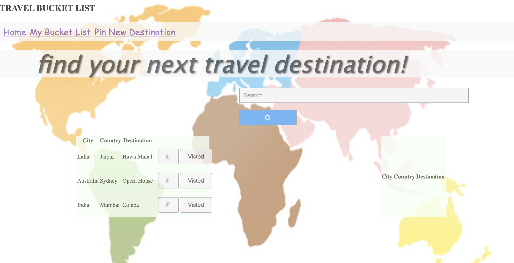
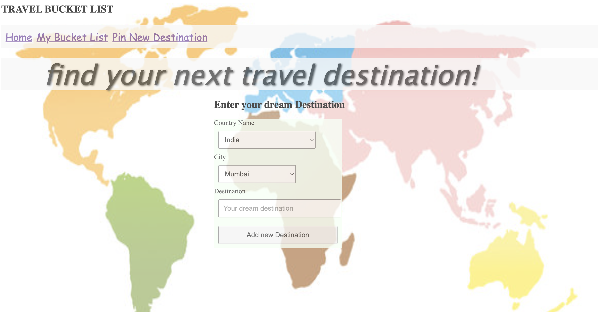
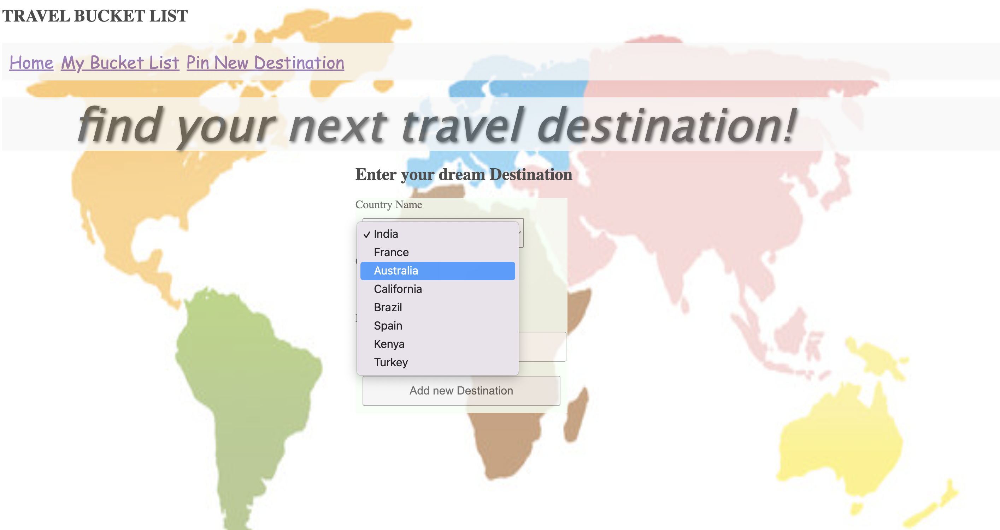
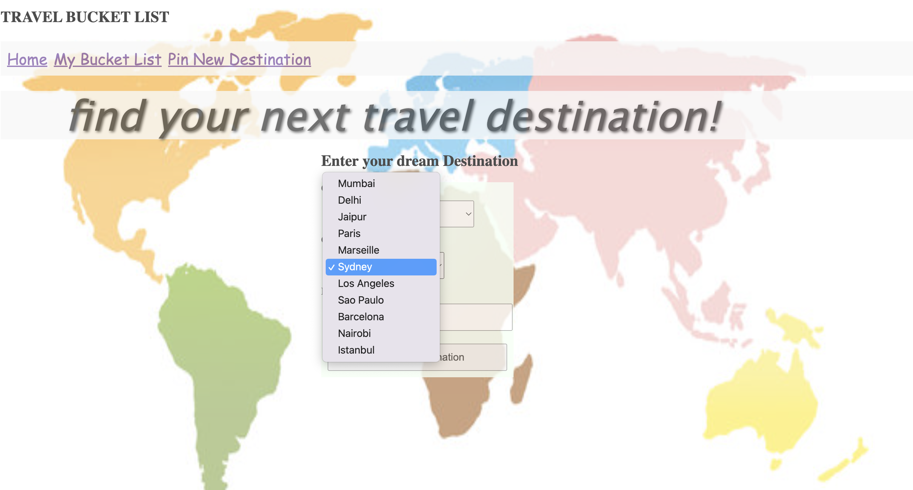
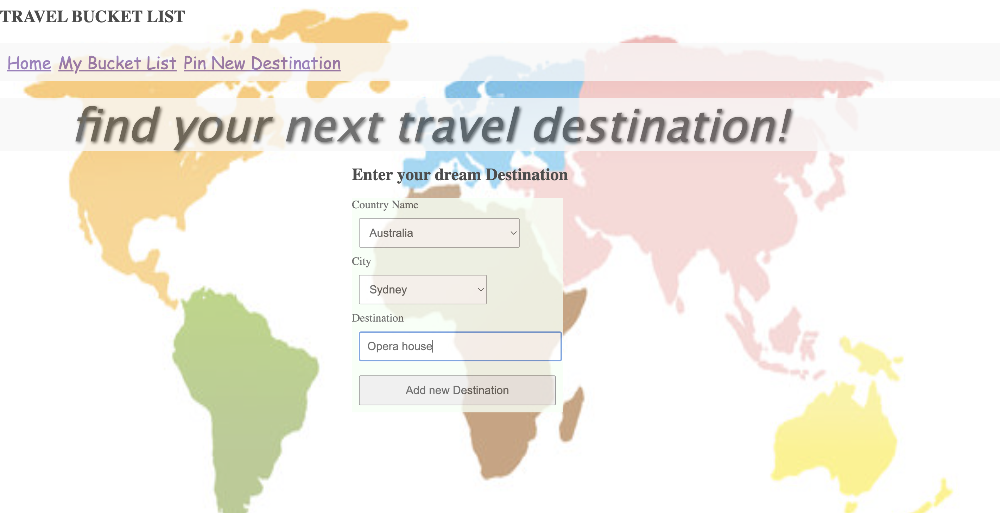
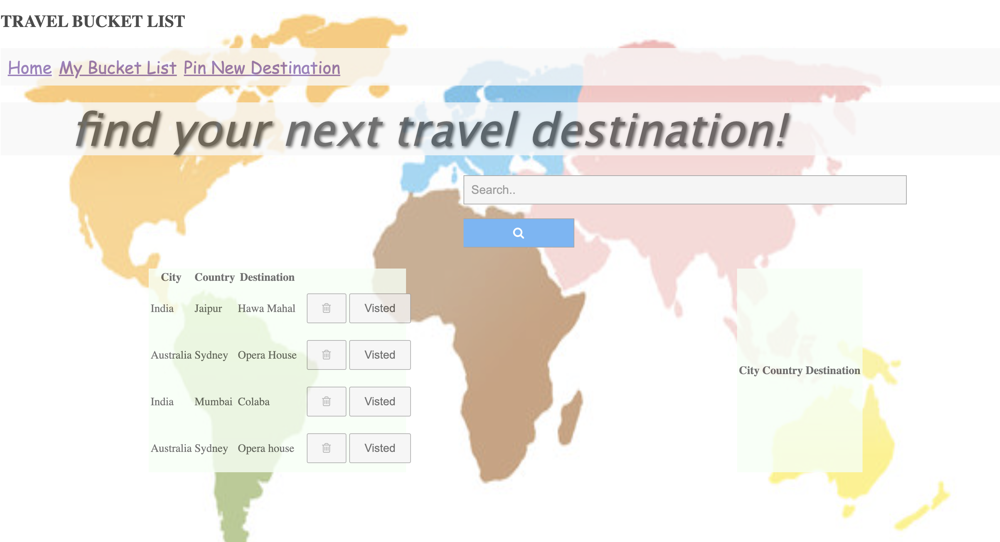
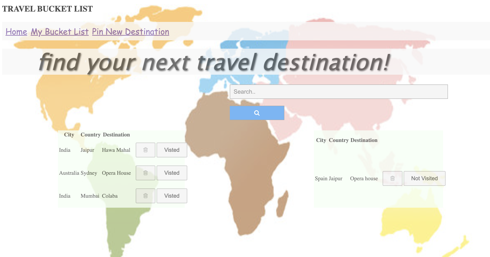

# Awara - the travel bucket list 

## Steps to run the app

- **Git clone** the repository
- **Create the Data base**
```
 createdb awara_bucketlist
```
- cd into db and run the psql command to create the tables
```
 psql -d awara_bucketlist -f awara_bucketlist.sql
```
- run console.py to populate the database
```
 python3 console.py
```
- run the **Flask App**
```
 flask run
```

## App Home page

.


## Bucket list page

.

## Adding destination to bucket list

.

## Select from existing country drop down from data base/ entering a new country

.

## Select from existing city drop down from data base/ entering a new city

.

## Enter the destination

.

## Find the destination in the bucket list

.

## Delete or Mark destination as visited

.

